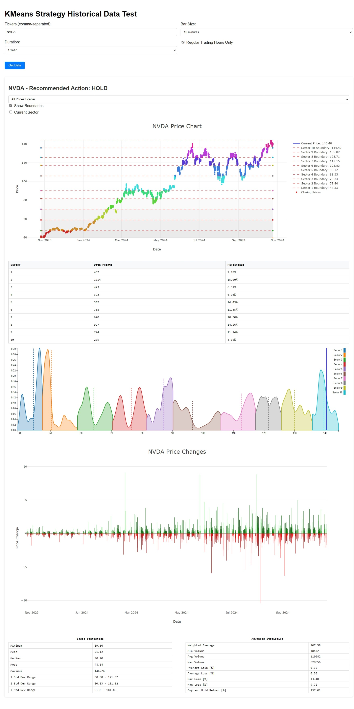

# K-Means Trading Strategy

<div align="center">



*An innovative algorithmic trading system using unsupervised machine learning for dynamic market sector analysis*

[](LICENSE)
[](https://python.org)
[](https://interactivebrokers.com)

</div>

## Project Overview

The **K-Means Trading Strategy** is an algorithmic trading system that leverages unsupervised machine learning to dynamically segment market price data into statistical sectors. By applying the K-means clustering algorithm to historical OHLC (Open, High, Low, Close) data, the system identifies optimal price ranges and generates trading signals based on statistical probability distributions and Kernel Density Estimation (KDE). An interactive dashboard/stock screener is included with key statistics generation that offer quick and detailed insights on a tickers behavior over a specified timeframe.

### Key Features

- **Unsupervised Learning**: Automatically discovers price sectors without predefined market assumptions
- **Real-time Analysis**: Live data processing with Interactive Brokers TWS integration
- **Interactive Dashboard**: Web-based visualization with multiple chart types and statistical analysis
- **Statistical Rigor**: Incorporates confidence intervals, KDE, and probabilistic ensemble learning.
- **Dynamic Clustering**: Automatically determines optimal number of clusters using the elbow method with curvature analysis
- **Multi-timeframe Support**: Flexible analysis across various timeframes and bar sizes

## Theoretical Foundation

### K-Means Clustering in Finance

This project applies K-means clustering to financial time series data in a novel way:

1. **Data Preparation**: All OHLC price points are flattened into a single dataset for clustering
2. **Optimal Cluster Detection**: Uses the elbow method with curvature analysis to automatically determine the ideal number of price sectors
3. **Sector Definition**: Creates price boundaries based on cluster centroids, dividing the price space into statistically significant regions
4. **Probability Analysis**: Each sector is analyzed using KDE to understand price probability distributions (discrete -> continuous)

### Statistical Framework

Each identified sector contains:
- **Boundaries**: Min/max price ranges based on cluster centroids
- **Expected Value**: Calculated using KDE integration over the sector range
- **Median Price**: Statistical center of sector price distribution
- **Epsilon/Threshold**: Dynamic tolerance levels for trade signal generation
- **Probability Density**: KDE-based probability distribution for informed decision making

### Trading Logic

The system generates trading signals based on:
- **Current Price Position**: Where the current price sits within its identified sector
- **Expected Value Deviation**: Distance from sector's statistical expected value
- **Threshold Analysis**: Whether price deviation exceeds dynamic thresholds
- **Boundary Proximity**: Avoiding trades near sector boundaries to reduce false signals

## Technical Architecture

```mermaid
flowchart TB
    TWS[Interactive Brokers TWS]
    WS[WebSocket Server<br/>(kmeans_test.py)]
    WD[Web Dashboard<br/>(HTML / JS / CSS)]
    KM[K-Means Strategy<br/>(kmeans_strategy.py)]
    C1[Clustering]
    C2[KDE Analysis]
    C3[Signal Generation]

    TWS <--> WS <--> WD
    WS --> KM
    KM --> C1
    KM --> C2
    KM --> C3
```


## Demo Visualizations

Access the videos through the media folder

### Single Ticker Analysis

*Real-time analysis showing price sectors, KDE distributions, and trading signals for individual stocks*

### Multi-Ticker Portfolio Analysis

*Simultaneous analysis across multiple tickers for portfolio-wide insights*

## 🚀 Quick Start

### Prerequisites

```bash
# Python dependencies
pip install numpy pandas scipy scikit-learn websockets ibapi

# Interactive Brokers TWS or IB Gateway
# Download from: https://www.interactivebrokers.com/en/trading/ib-api.php
```

### Setup & Execution

1. **Configure Interactive Brokers**
   - Login to TWS Workstation
   - Ensure all datafarm connections are active (click DATA button)
   - Enable API connections in TWS settings

2. **Start the Analysis Server**
   ```bash
   cd src/
   python kmeans_test.py
   ```

3. **Launch Dashboard**
   ```bash
   # Option 1: Direct browser access
   open kmeans_test.html

   # Option 2: VS Code Live Server
   # Right-click kmeans_test.html → "Go Live"
   ```

4. **Configure Analysis Parameters**
   - **Tickers**: Enter comma-separated symbols (e.g., `AAPL, MSFT, GOOGL`)
   - **Bar Size**: Choose from 1min to 1day intervals
   - **Duration**: Select historical period (1D to 5Y)
   - **Trading Hours**: Enable/disable regular trading hours filter

## 📁 Project Structure

```
kmeans_trading/
├── src/
│   ├── kmeans_strategy.py    # Core K-means trading algorithm
│   ├── kmeans_test.py       # WebSocket server & IB integration
│   ├── kmeans_test.html     # Interactive web dashboard
│   ├── kmeans_test.js       # Frontend logic & visualizations
│   └── kmeans_test.css      # Dashboard styling
├── media/
│   ├── K_Means_Demo.jpeg    # Strategy visualization
│   ├── Single_Ticker_Demo.mp4
│   └── Multi_Ticker_Demo.mp4
├── LICENSE                  # MIT License
└── README.md               # This file
```

## Dashboard Features

### Interactive Controls
- **Chart Types**: Candlestick, line, and scatter plot visualizations
- **Sector Boundaries**: Toggle cluster boundary visibility
- **Current Sector Focus**: Zoom to active price sector
- **Real-time Updates**: Live data streaming and analysis

### Statistical Analysis
- **Basic Statistics**: Min/Max, Mean, Median, Mode, Standard Deviations
- **Advanced Metrics**: Weighted averages, volume analysis, gain/loss ratios
- **KDE Visualizations**: Probability density functions for each sector
- **Performance Metrics**: Buy-and-hold returns, volatility measures

### Trading Signals
- **BUY**: Current price significantly below sector expected value
- **SELL**: Current price significantly above sector expected value
- **HOLD**: Price near boundaries or within acceptable deviation range

## Professional Impact

This project demonstrates:

- **Machine Learning Expertise**: Practical application of unsupervised learning in finance
- **Full-Stack Development**: End-to-end system with backend Python and interactive frontend
- **Financial Domain Knowledge**: Understanding of market microstructure and trading systems
- **Real-time Systems**: WebSocket-based architecture for live data processing
- **Data Visualization**: Advanced charting with D3.js and Plotly integration
- **API Integration**: Professional-grade broker connectivity with Interactive Brokers

## 📈 Performance Characteristics

The strategy excels in:
- **Ranging Markets**: Identifies mean-reversion opportunities within established sectors
- **Volatility Clustering**: Adapts sector boundaries to changing market regimes
- **Risk Management**: Built-in boundary detection prevents trades at inflection points
- **Multi-timeframe Analysis**: Consistent performance across various time horizons

## ⚠️ Risk Disclaimer

This project is for **educational and demonstration purposes only**. It is not intended as financial advice or a recommendation to buy or sell securities. Always conduct thorough backtesting and risk assessment before deploying any algorithmic trading strategy with real capital.

## 📄 License

This project is licensed under the MIT License - see the [LICENSE](LICENSE) file for details.

---
